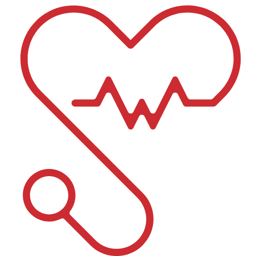

<!-- PROJECT LOGO -->
 

  

  <h2 align="center">Medical Portfolio</h2>
  <h4 align="center">HTML & CSS Project</h4>

  

Building medical portfolio from scratch. This portfolio was built using HTML and CSS, it is dedicated to my sister, who is a doctor, so I decide to create a portfolio for her, so she could have a visual and online resume, and for me to practice and develop my creativity and skills of HTML and CSS. 
     
     
    <a href="https://github.com/RaulMaya/Medical-Portfolio">Repository</a>    
    ·
    <a href="https://raulmaya.github.io/Medical-Portfolio/">Deployment</a>
    ·
    <a href="https://www.linkedin.com/in/raul-maya/">My LinkedIn</a>

  

<!-- ABOUT THE PROJECT -->

### About The Project

The project was developed using tools such as HTML and CSS, the project consist on developing a portfolio using just HTML and CSS, following a semantic structure and CSS rules, taking care of not overdefining the CSS styles.

| 
 Medical Portfolio 
               |
| ------------------------------------------------------ |
|  |

### Contact :iphone:

- Name: Raul Maya Salazar
- Phone: +52 833 159 7006
- E-mail: raulmayas20@gmail.com
- GitHub: https://github.com/RaulMaya
- LinkedIn: https://www.linkedin.com/in/raul-maya/

(<a href="#top">back to top</a>)

